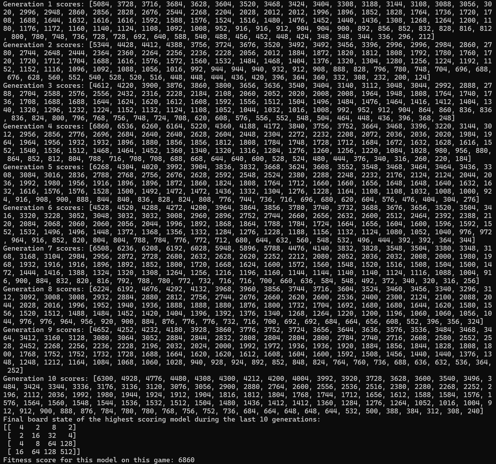
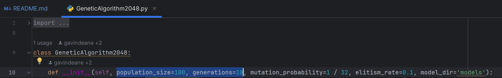

# 2048ThousandLeaguesUnderTheSea

This project uses a genetic algorithm to train a neural network to play the 2048 game.

## Prerequisites

- Python 3.8+
- pip (Python package installer)

## Setup

1. Clone the repository:
   ```bash
   git clone https://github.com/colinseifert/2048ThousandLeaguesUnderTheSea.git
   cd 2048ThousandLeaguesUnderTheSea
   
2. Create and activate a python virtual environment
```bash
python -m venv myenv
```

3. Install the required dependencies
```bash
python -m pip install -r requirements.txt
```

## Running the Project

To run the genetic algorithm:
```bash
python GeneticAlgorithm2048.py
```

The output should look something like this:



Shown are the final scores of individuals in each generation, along with the final
board state and fitness score of the highest-scoring model across all generations run.

A plot of the best score from each generation should also appear.

By default, the genetic algorithm is set to run a population size of 100 models for 10 generations, if you want to
play with the parameters, go into GeneticAlgorithm2048.py and change the default parameters shown:


If you wish to discard a population and train a fresh model, delete the created models folder. Otherwise training
will continue from the last saved population.

## Project Structure

**GeneticAlgorithm2048.py**: Entry point for running the genetic algorithm.

**MoveGenerator.py**: Contains the logic for generating moves based on the neural network.

**Game2048.py**: Implements the 2048 game mechanics.

**Game2048NN.py**: Defines the neural network model for the 2048 game.

**GameController.py**: Old code for running game in browser using selenium. **Do not use**

**requirements.txt**: Lists the required Python packages.